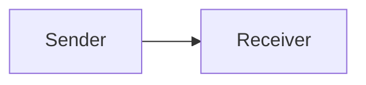
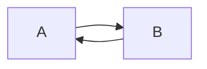
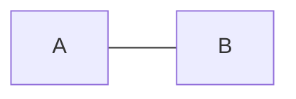
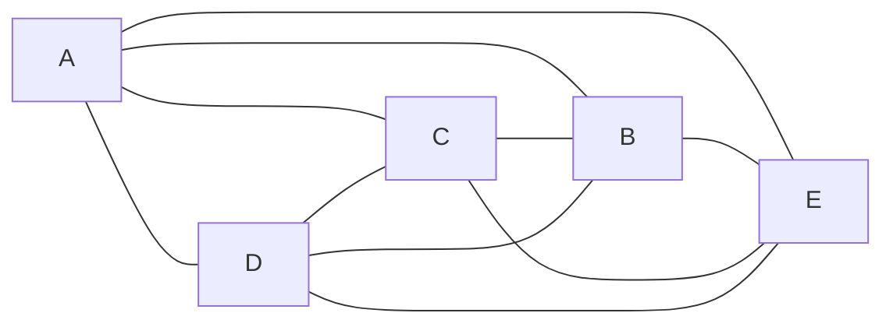
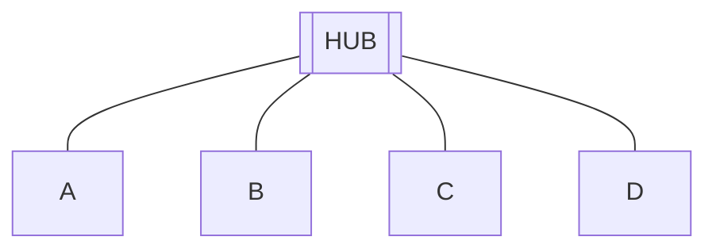
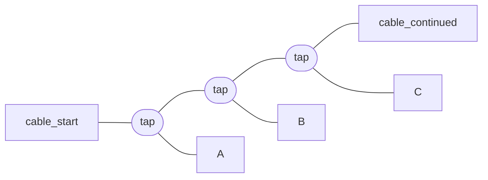
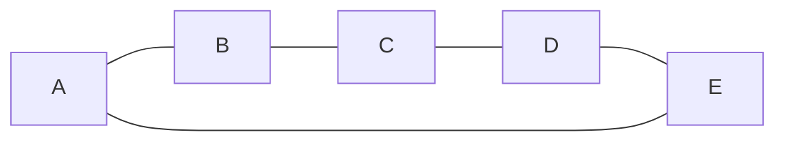
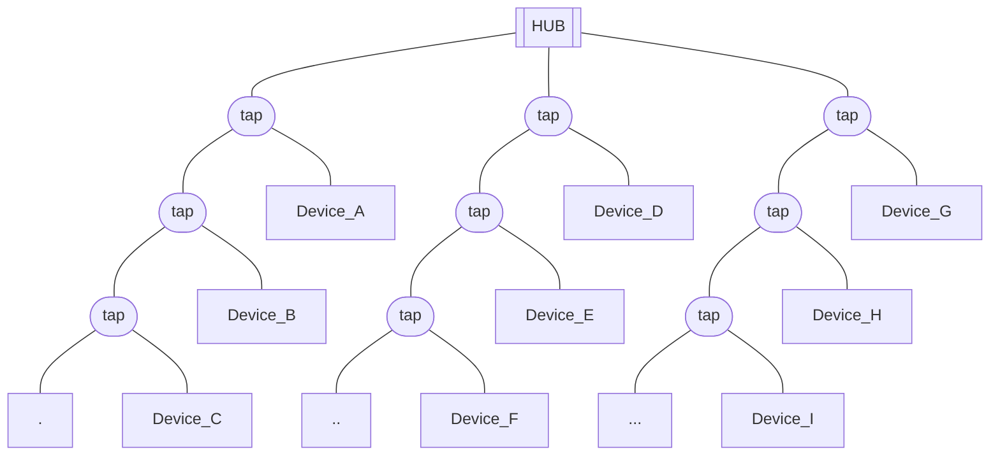

For communication to happen, there needs to be **Data**, **Sender**, **Receiver**.

>**Simplex:** One directional data flow

>**Half-Duplex:** Two-Way communication but not at the same time.

>**Full-Duplex:** Two-Way communication at the same time

### Effectiveness
- > **Delivery:** The data actually reaches its intended recipient.
- >**Accuracy:** The data received is not altered in any way.
- >**Timeliness:** The data reaches the recipient with an acceptable delay.
- >**No Jitter:** The data arrives all at the same time.

### Types of Connection
1. **Point-to-point:** 
    - Dedicated Link between two devices
    - The entire bandwidth is reserved for the two devices
1. **Multi-point:**
    - Multiple devices share a single link.
    - Bandwidth is shared. (Channels)?

### Physical Topology
#### Mesh Topology

Each device is connected to all others through a point-to-point connection.
In this topology, $\frac{n(n-1)}{2}$ connections are required for `n` devices.
- Advantage:
    - If a connection is broken, all other devices can continue communication.
- Disadvantage:
    - A lot of wiring required.
#### Star Topology

- Advantage:
    - `n` connections/wiring required.
    - If a station/device is down, the network is intact.
- Disadvantage:
    - Centralized hub is a Single Point Of Failure. If it is down, the network breaks down.
#### Bus Topology

- Advantage:
    - `n` connections/wiring required.
    - If a station/device is down, the network is intact.
- Disadvantage:
    - The cable is still a Single Point Of Failure. If it is down, the network breaks down.
#### Ring Topology

- Advantage:
    - `n` connections required
    - If one device is down, the network is intact (Iff there is two-way communication).
- Disadvantage:
    - For One-Way Connections, if one connection is down, all devices cannot communicate.

### Hybrid

### Network Criteria
>**Reliability:** Frequency of failure is minimal

>**Security:** 

>**Reliability:**
