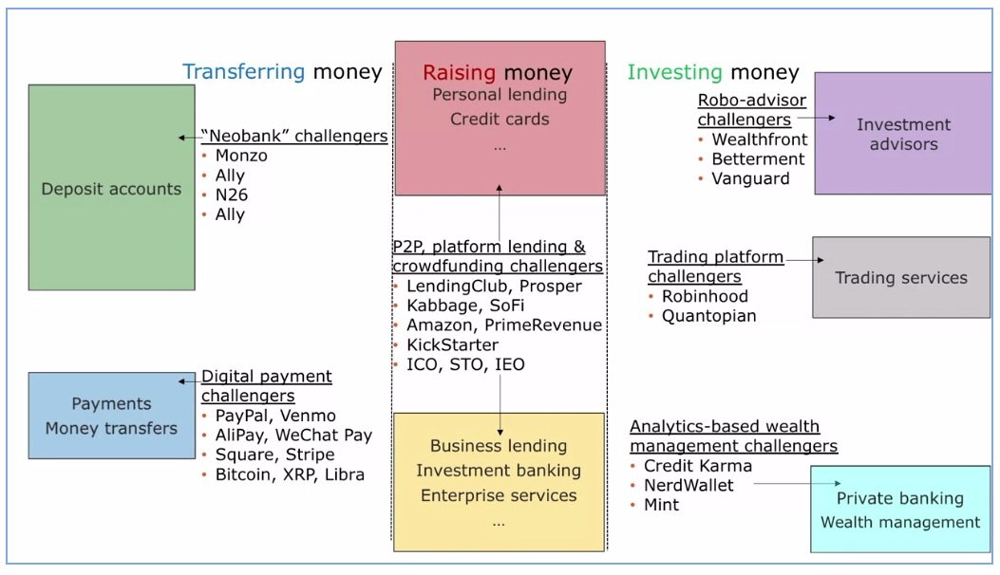

### People in charge
Historically, the financial institutions have been leading the charge for innovations. The Banks, the Investment Managers, the hedgefunds.
Now its the **tech companies**.
Why?
- Access to consumer data [[Big Data]] 
- Not subject to strict regulations like Financial Institutions.
So they can take more risks with new tech and products and markets.

### Banks
What do they do?

- Transferring Money
    - They have **Deposit Accounts**.
    - They provide **Payment and Transfer** Services (to move money between the accounts).
- Raising Money
    - They provide lending services like **Personal/Business Loans**, **Credit Cards**, etc.
    - They have **Investment Banking** division that help businesses to raise money from debt and equity markets by issuing bonds and stocks.
- Investing Money
    - They provide **Investment Advisory** services.
    - They have a **Trading Department** to provide brokerage and settlement services for traders.
    - They have **Private Banking** and **Wealth Management** services for rich people for a fee.

>**Modern Fintech:** Technological innovations that improve how money and capital are transferred, raised and invested.

