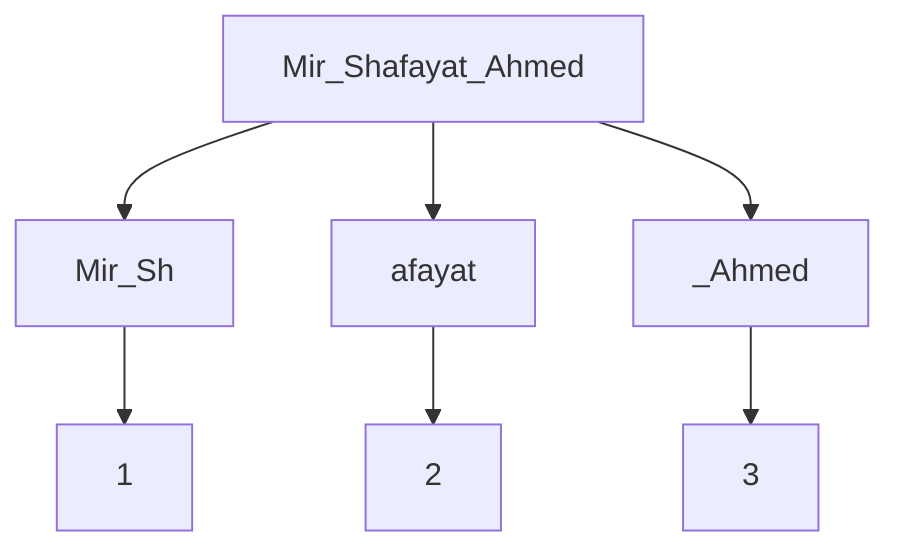

# Internet History

## Blechley Park
World war 2. 
Top secret code breaking effort from germans.
Necessary to do effective communication.

**Need for wireless communication over long distances**
But they had to be encrypted.

e.g Enigma Machine.

Mechanical Computers were there but later they were too slow. So the modern computers were made. The Electronic Computer.

Stuff happened.

## Post War (1940s)
People from blechley park went separate ways and came up with more eectronic computers.

## 1950s
yeah more innovation. US and other people decided to invest in academia and stuff.

## 1960s

Computers were very rare and precious. One Comp in a whole state.
So they had to be connected to from terminals. through modems. Dialup and stuff.

To talk with UNI people very far, they had to hop computers through leased connections.

Along the routes, more schools were located who gradually joined the network.

## 1980s
BITNET : the existing method
ARPANET : concept of packets introduced. 
- Break data into packets.
- a much smaller data needs to be sent.
- no need to wait for big data to go.
- can take turns sending packets from the two datas.
- all packets of small data get sent.
- resume sending big data.

Obviously more complex software needed.

New specialized computers created called Routers for traffic control.

## Packet Switching
Think Postcards.

all packets have a certain size. A from and to address. A label

The post office is called a **Gateway**

## 1