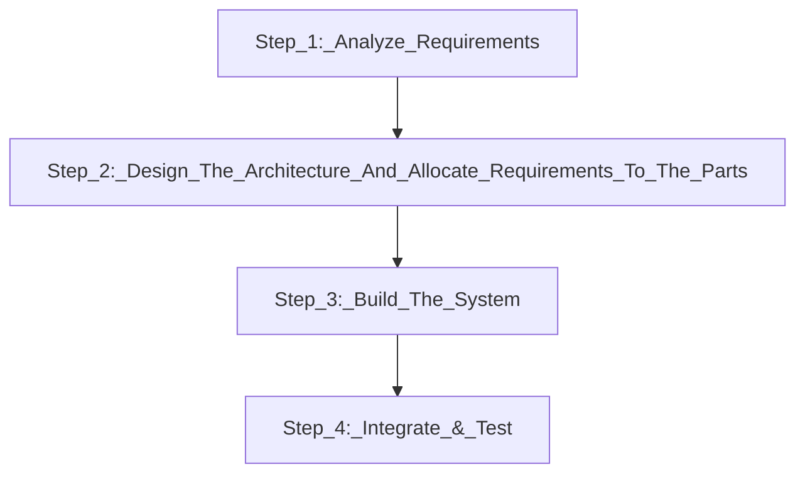

### The Systems Engineering Lifecycle

It is the highest level **technical** lifecycle for a product or system being built.
When a system is developed, people from multiple disciplines have to work together to make it.
It starts with a **system concept** and ends with **system integration**.

## General Model of a Lifecycle
They follow a sequence of phases or time period.

**The phases need not be equal in length.**
Each phase may have a sub-phase.

**Not all Lifecycles are sequential.**
There can be **Overlapping Phases**, **Parallel Phases**, **Repeated Cycles**.

### Typical Product Development Lifecycle

>**Phases:** Distinct **periods of time** during which development occurs.

>**Milestones:** **Events that mark phase boundaries**

>**Goals:** **Objectives** for each phase and overall development.

